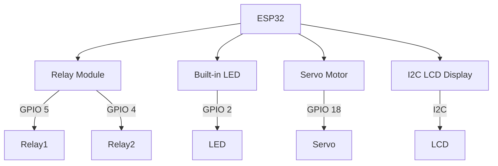
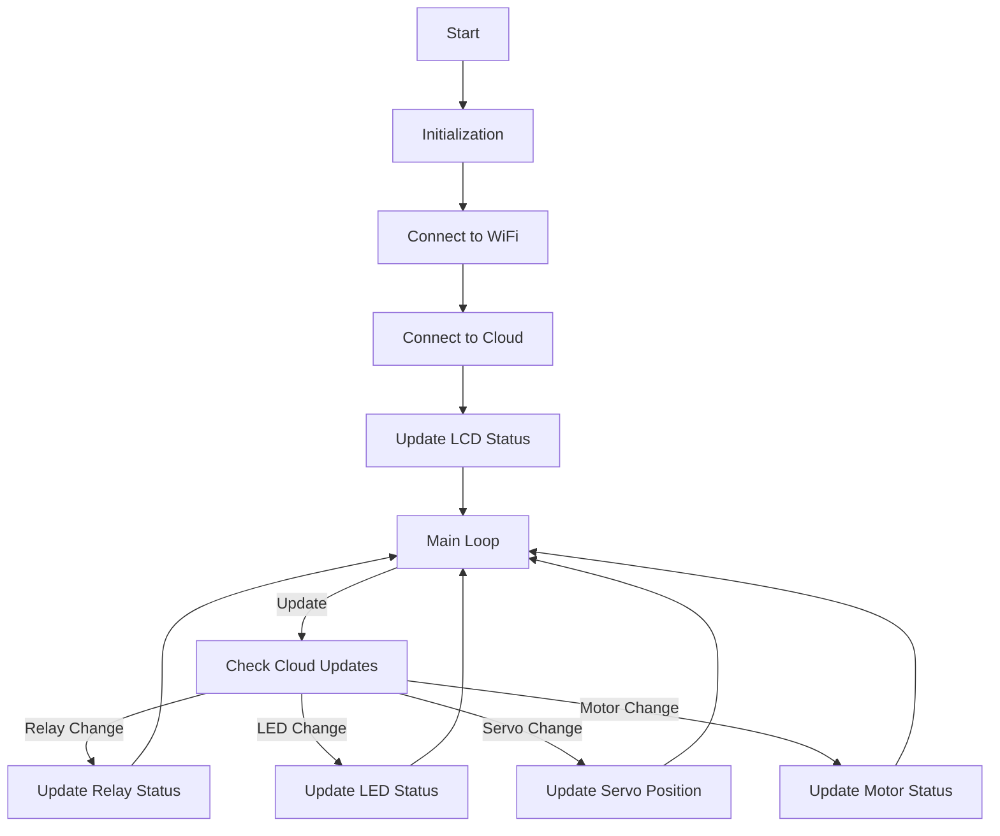

# Arduino IoT Cloud with ESP32: Relay, LED, Motor, and Servo Control

This project integrates an ESP32 with the Arduino IoT Cloud to control a relay, LED, motor, and servo. It also includes an LCD for local status display. 

## Components

- ESP32
- 2-Channel Relay Module
- Servo Motor
- Built-in LED
- Motor
- I2C LCD Display

## Features

- Wi-Fi connection to Arduino IoT Cloud
- Remote control via IoT Cloud dashboard
- Real-time status display on LCD
- Servo sweeping functionality

## Setup and Implementation

### Step 1: Create an Arduino IoT Cloud Thing

1. Go to the [Arduino IoT Cloud](https://create.arduino.cc/iot) and create a new Thing.
2. Define the following variables:
   - `lED_In_Built` (CloudLight, READ/WRITE)
   - `relay1` (CloudSwitch, READ/WRITE)
   - `servo` (int, READ/WRITE)
   - `motor` (bool, READ/WRITE)

### Step 2: Connect the Components

1. **Relay Module**:
    - IN1 to GPIO 5 (relay1)
    - IN2 to GPIO 4 (relay2)
2. **Built-in LED**:
    - Already connected to GPIO 2 (ledInBuilt)
3. **Servo Motor**:
    - Signal pin to GPIO 18 (servoPin)
4. **I2C LCD Display**:
    - Connect SCL and SDA to appropriate ESP32 pins

### Step 3: Install Libraries

Ensure you have the following libraries installed in your Arduino IDE:
- `WiFi`
- `ESP32Servo`
- `hd44780`
- `ArduinoIoTCloud`
- `Arduino_ConnectionHandler`

### Step 4: Code

You can find the complete code [here](https://github.com/your-repo/arduino-iot-cloud-control).

#### Include Libraries and Define Pins

Include necessary libraries and define pin connections:
```cpp
#include <WiFi.h>
#include <ESP32Servo.h>
#include <hd44780.h>
#include <hd44780ioClass/hd44780_I2Cexp.h>
#include "thingProperties.h"

// GPIO pins
#define servoPin 18
#define relay1Pin 5
#define relay2Pin 4
#define ledInBuilt 2

Servo myservo;
int servoPosition = 90; // default position
bool sweeping = false;
bool cloudConnected = false;

hd44780_I2Cexp lcd; // declare lcd object: auto locate & config expander chip

// LCD geometry
const int LCD_COLS = 16;
const int LCD_ROWS = 4;

// Replace with your network credentials
const char* ssid     = "910";
const char* password = "Bl3ss3d@20";
```

#### Setup Function

The `setup()` function initializes the pins, serial communication, WiFi, and IoT Cloud connection:
```cpp
void setup() {
  pinMode(relay1Pin, OUTPUT);
  pinMode(relay2Pin, OUTPUT);
  pinMode(ledInBuilt, OUTPUT);
  
  Serial.begin(115200);
  myservo.attach(servoPin);  // attaches the servo on the servoPin to the servo object

  lcd.begin(LCD_COLS, LCD_ROWS);
  lcd.backlight();
  lcd.setCursor(0, 0);
  lcd.print("Connecting to WiFi");

  // Connect to Wi-Fi network with SSID and password
  WiFi.begin(ssid, password);
  while (WiFi.status() != WL_CONNECTED) {
    delay(500);
    lcd.print(".");
  }
  
  lcd.clear();
  lcd.setCursor(0, 0);
  lcd.print("WiFi Connected");
  lcd.setCursor(0, 1);
  lcd.print(WiFi.localIP());

  // Cloud Part
  lcd.setCursor(0, 2);
  lcd.print("Connecting to Cloud");
  // Initialize properties
  initProperties();
  // Connect to Arduino IoT Cloud
  ArduinoCloud.begin(ArduinoIoTPreferredConnection);
  setDebugMessageLevel(2);
  ArduinoCloud.printDebugInfo();
  cloudConnected = true;
  
  lcd.setCursor(0, 2);
  lcd.print("Cloud Connected");
  delay(1000);
  lcd.clear();
}
```

#### Loop Function

The `loop()` function updates the Arduino Cloud and checks for changes:
```cpp
void loop() {
  ArduinoCloud.update();

  // Update LCD with current status
  lcd.setCursor(0, 0);
  lcd.print("Sol: ");
  lcd.print(digitalRead(relay1Pin) ? "ON " : "OFF");
  lcd.print(" Motor: ");
  lcd.print(digitalRead(relay2Pin) ? "ON " : "OFF");
  lcd.setCursor(0, 1);
  lcd.print("LED: ");
  lcd.print(digitalRead(ledInBuilt) ? "ON " : "OFF ");
  lcd.print(" Cloud: ");
  lcd.print(cloudConnected ? "ON " : "OFF");

  if (sweeping) {
    servoPosition += 1; // Incrementing by 1 for sweeping effect
    if (servoPosition >= 180 || servoPosition <= 0) {
      servoPosition = 90; // Reset to default position
    }
    myservo.write(servoPosition);
    delay(15); // Adjust speed of sweeping
  }
}
```

#### Cloud Change Functions

These functions handle changes in the cloud variables:
```cpp
void onRelay1Change() {
  if (relay1) {
    digitalWrite(relay1Pin, LOW);
    Serial.println("Solenoid OFF");
  } else {
    digitalWrite(relay1Pin, HIGH);
    Serial.println("Solenoid ON");
  }
}

void onLEDInBuiltChange() {
  if (lED_In_Built) {
    digitalWrite(ledInBuilt, HIGH);
    Serial.println("LED_In_Built ON");
  } else {
    digitalWrite(ledInBuilt, LOW);
    Serial.println("LED_In_Built OFF");
  }
}

void onMotorChange() {
  if (motor) {
    digitalWrite(relay2Pin, HIGH);
    Serial.println("Motor ON");
  } else {
    digitalWrite(relay2Pin, LOW);
    Serial.println("Motor OFF");
  }
}

void onServoChange() {
  myservo.write(servo);
}
```

## How to Implement

1. **Create Thing on Arduino IoT Cloud**:
   - Go to the Arduino IoT Cloud.
   - Create a new Thing and add the variables as specified.
   
2. **Setup Hardware**:
   - Connect your components as described in the component section.

3. **Upload Code**:
   - Copy the provided code into your Arduino IDE.
   - Ensure the correct board and port are selected.
   - Upload the code to your ESP32 board.

4. **Control via Dashboard**:
   - Use the Arduino IoT Cloud dashboard to monitor and control your relays, LED, servo, and motor.

### Monitoring and Control

Once your setup is complete and the code is uploaded, you can use the Arduino IoT Cloud dashboard to:
- Toggle the relay on/off.
- Control the built-in LED.
- Set the position of the servo motor.
- Toggle the motor on/off.

## Comparisons and Illustrations

### Components Comparison

| Component     | Description                                      | Pin Configuration |
|---------------|--------------------------------------------------|-------------------|
| Relay         | Controls high voltage devices                    | GPIO 5 and GPIO 4 |
| Built-in LED  | On-board LED for status indication               | GPIO 2            |
| Servo Motor   | Rotates to a specific position                   | GPIO 18           |
| I2C LCD Display | Displays real-time status information          | I2C pins          |

### System Diagram



### Control Flow Chart



## Resources

- [Arduino IoT Cloud](https://create.arduino.cc/iot)
- [Arduino Cloud Documentation](https://www.arduino.cc/en/IoT/HomePage)

For the full code and more details, visit the [GitHub repository](https://github.com/your-repo/arduino-iot-cloud-control).